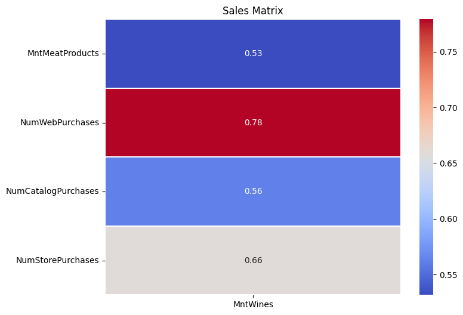
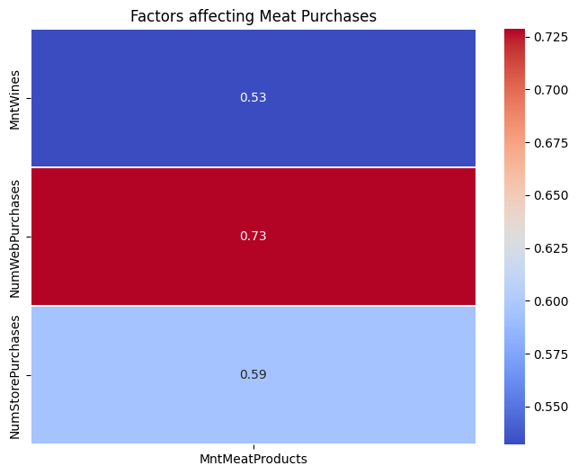
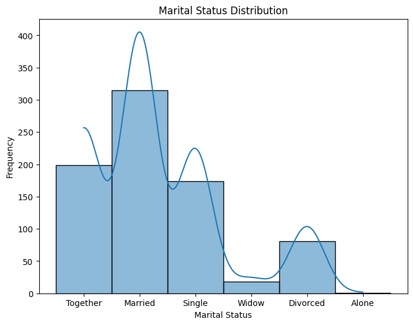
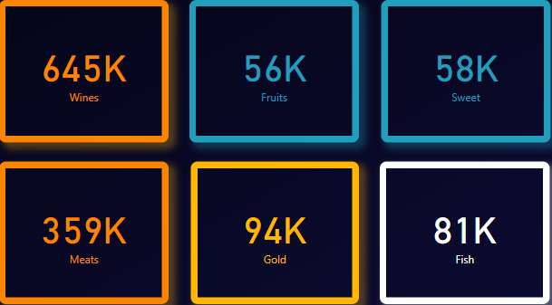
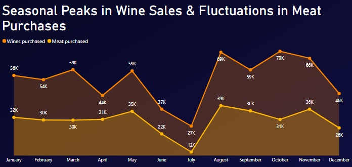
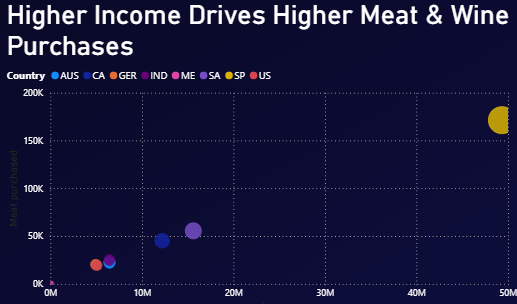
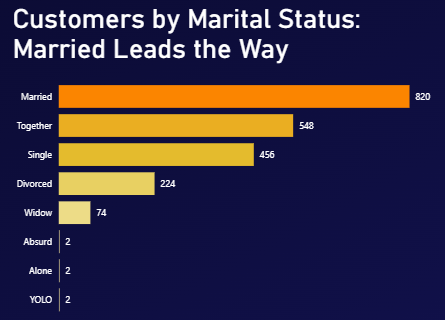
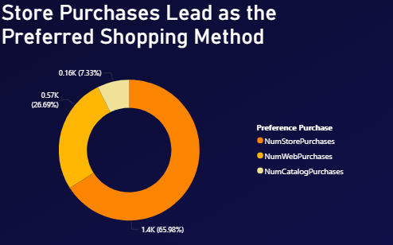
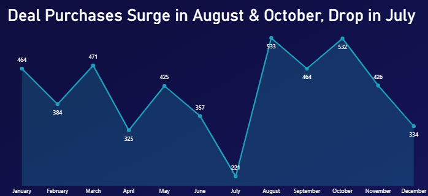

# Optimizing revenue by leveraging insights from top-selling products and customer purchasing pattern

## 1) Purpose and Outcome

### **Purposes:**
- Identify the **top-selling products**.
- Analyze whether **online, catalog, or store purchases** contribute most significantly.
- Examine if an **increase in catalog purchases correlates** with higher gold or wine product sales.
- Detect **purchasing patterns that suggest bundled behavior** (e.g., people who buy fruits also buy specific items).

### **Outcomes:**
✅ Identify the **best-selling products**.
✅ Determine **key factors driving an increase in product purchases**.
✅ Understand **which sales channel (catalog, online, or store) is the most significant**.
✅ Discover **correlations between different product categories**.
✅ Gain insights into **buying patterns for cross-selling opportunities** (e.g., fruits + sweets).
✅ Provide **actionable recommendations for revenue optimization**:
   - If **catalog purchases drive both wine and gold sales**, focus marketing efforts on catalog-based promotions.
   - If **e-commerce purchases lead to higher spending per transaction**, prioritize digital transformation strategies.

## 2) Technologies Used

### **Python:**
Used for data processing, analysis, and modeling:
- **Reading and cleaning** the dataset.
- **Performing exploratory data analysis (EDA).**
- **Building a correlation matrix** to identify relationships between variables.
- **Implementing machine learning models** to predict wine purchases.

### **Power BI:**
Utilized for data visualization and dashboard creation:
- **Interactive analysis** of customer purchasing behavior.
- **Visualization of key insights and trends** for decision-making.

## 3) Data Sources
The dataset used in this analysis is sourced from the **SCA Programming School** and is publicly available on **GitHub**.

### **Dataset Details:**
- **Dataset Name:** Marketing Data with Missing Values
- **Description:** The dataset includes **demographic information, purchase behavior, and various marketing-related metrics**. Some values are missing, requiring **data cleaning and preprocessing** before analysis.
- **Usage:** The dataset is used for **exploratory data analysis (EDA), correlation analysis, and machine learning modeling** to understand factors influencing customer purchases.

## 4) Data Overview
|    ID |   Year_Birth | Education   | Marital_Status   | Income     |   Kidhome |   Teenhome | Dt_Customer   |   Recency |   MntWines |   MntFruits |   MntMeatProducts |   MntFishProducts |   MntSweetProducts |   MntGoldProds |   NumDealsPurchases |   NumWebPurchases |   NumCatalogPurchases |   NumStorePurchases |   NumWebVisitsMonth |   AcceptedCmp3 |   AcceptedCmp4 |   AcceptedCmp5 |   AcceptedCmp1 |   AcceptedCmp2 |   Response |   Complain | Country   |
|------:|-------------:|:------------|:-----------------|:-----------|----------:|-----------:|:--------------|----------:|-----------:|------------:|------------------:|------------------:|-------------------:|---------------:|--------------------:|------------------:|----------------------:|--------------------:|--------------------:|---------------:|---------------:|---------------:|---------------:|---------------:|-----------:|-----------:|:----------|
|  1826 |         1970 | Graduation  | Divorced         | $84,835.00 |         0 |          0 | 6/16/14       |         0 |        189 |         104 |               379 |               111 |                189 |            218 |                   1 |                 4 |                     4 |                   6 |                   1 |              0 |              0 |              0 |              0 |              0 |          1 |          0 | SP        |
|     1 |         1961 | Graduation  | Single           | nan        |         0 |          0 | 6/15/14       |         0 |        464 |           5 |                64 |                 7 |                  0 |             37 |                   1 |                 7 |                     3 |                   7 |                   5 |              0 |              0 |              0 |              0 |              1 |          1 |          0 | CA        |
| 10476 |         1958 | Graduation  | Married          | $67,267.00 |         0 |          1 | 5/13/14       |         0 |        134 |          11 |                59 |                15 |                  2 |             30 |                   1 |                 3 |                     2 |                   5 |                   2 |              0 |              0 |              0 |              0 |              0 |          0 |          0 | US        |
|  1386 |         1967 | Graduation  | Together         | $32,474.00 |         1 |          1 | nan           |         0 |         10 |           0 |                 1 |                 0 |                  0 |              0 |                   1 |                 1 |                     0 |                   2 |                   7 |              0 |              0 |              0 |              0 |              0 |          0 |          0 | AUS       |
|  5371 |         1989 | Graduation  | Single           | $21,474.00 |         1 |          0 | 4/8/14        |         0 |          6 |          16 |                24 |                11 |                  0 |             34 |                   2 |                 3 |                     1 |                   2 |                   7 |              1 |              0 |              0 |              0 |              0 |          1 |          0 | SP        |


The dataset contains **customer marketing and purchasing information**, offering insights into consumer behavior and spending patterns. The attributes are categorized into four main sections: **People, Products, Promotion, and Place**.

### **4.1. People (Customer Demographics & Behavior)**
This section includes demographic information and customer engagement with the company:
- **ID:** Unique identifier for each customer.
- **Year_Birth:** Customer’s birth year.
- **Education:** Education level of the customer.
- **Marital_Status:** Customer’s marital status.
- **Income:** Annual household income.
- **Kidhome:** Number of children in the household.
- **Teenhome:** Number of teenagers in the household.
- **Dt_Customer:** Date when the customer enrolled with the company.
- **Recency:** Number of days since the customer’s last purchase.
- **Complain:** Whether the customer has filed a complaint in the last two years (1 = Yes, 0 = No).

### **4.2. Products (Customer Spending on Various Categories)**
Represents the total amount spent by customers on different product categories over the last two years:
- **MntWines:** Amount spent on wine.
- **MntFruits:** Amount spent on fruits.
- **MntMeatProducts:** Amount spent on meat.
- **MntFishProducts:** Amount spent on fish.
- **MntSweetProducts:** Amount spent on sweets.
- **MntGoldProds:** Amount spent on gold.

### **4.3. Promotion (Marketing Campaign Engagement)**
Indicates customer participation in various promotional campaigns:
- **NumDealsPurchases:** Number of purchases made using discounts.
- **AcceptedCmp1–AcceptedCmp5:** Whether the customer accepted offers from past campaigns (1 = Yes, 0 = No).
- **Response:** Whether the customer accepted the offer in the latest campaign (1 = Yes, 0 = No).

### **4.4. Place (Shopping Channels & Preferences)**
Captures the number of purchases and interactions across different sales channels:
- **NumWebPurchases:** Purchases made through the company’s website.
- **NumCatalogPurchases:** Purchases made using a catalog.
- **NumStorePurchases:** Purchases made directly in stores.
- **NumWebVisitsMonth:** Number of visits to the company’s website in the last month.

### Dataset Scope
The dataset provides a **comprehensive view of customer demographics, spending habits, promotional response, and preferred shopping channels**.

- It includes **both numerical and categorical data**, requiring **preprocessing for missing values** and **feature engineering** before analysis.
- The dataset is **ideal for EDA, trend analysis, and predictive modeling**.

## 5) Data Cleaning
There are four columns with missing values:
+ `Education` (category) => replace missing values with mode
+ `Income` (Category) => replace missing values with mode
+ `DT_Customer` (Category) => replace missing values with NaT
+ `NumWebVisitsMonth` (number) => replace missing values with mean

```python
def replace_missing_value(col_name, replace_type):
    if replace_type == "mean":
        df[col_name] = df[col_name].fillna(df[col_name].mean())
    elif replace_type == "mode":
        df[col_name] = df[col_name].fillna(df[col_name].mode()[0])
    elif replace_type == "median":
        df[col_name] = df[col_name].fillna(df[col_name].median())
    return df[col_name]
```

## 6) EDA Process
### **What caused the increase in the number of products purchased?**
Focus on products, such as:
+ Wines => `MntWines`
+ Fruits => `MntFruits`
+ Meat => `MntMeatProducts`
+ Fish => `MntFishProducts`
+ Sweet => `MntSweetProducts`
+ Gold => `MntGoldProds`

### 6.1. Wines


### 6.2. Fruits
+ MntSweetProducts:  **0.583519**

### 6.3. Meat


### 6.4. Fish

### 6.5. Sweet
+ MntFruits:   **0.583519**

### 6.6. Gold
+ NumCatalogPurchases:   **0.568304**

### Plotting histogram to observe the marital status distribution


- The majority of customers are either married or in a relationship


## 7) Visualization 

### 7.1. Product Purchase Amount


#### **Import Data**
- The dataset includes categories such as Wines, Fruits, Sweets, Meats, Gold, and Fish, with their respective sales values.
- Load this data into Power BI via **CSV**.

#### **Create Individual Cards**
- Go to the **"Visualizations"** pane in Power BI.
- Select the **"Card"** visual.
- Drag the appropriate field (e.g., `MntWines`, `MntFruits`) into the **"Fields"** section to display the respective value.

#### **Customize the Card Formatting**
- **Font and Colors:** Set distinct color-coded borders and text styles using **Format Pane → Data Label & Title options**.
- **Border and Background:**
  - Adjust **Border settings** under **Format Pane**.
  - Use a **dark theme** via **View → Themes**.
- **Font Size and Display Format:** Values appear in **K format** (e.g., `645K`).
- **Conditional Formatting:** Apply conditional formatting to emphasize specific values (e.g., highest/lowest category).
- **Arranging the Cards:** Arrange in a **grid layout** using **alignment guides**.

#### **Purpose of These Cards**
- **KPI Dashboard Summary:** Provides a quick glance at product performance.
- **Decision-Making:** Helps managers identify top-selling and low-performing categories.
- **Comparative Analysis:** Color-coded approach for distinguishing categories.
- **Interactive Dashboard Element:** Cards can be linked with filters for further analysis.

---

### 7.2 Line Chart: Wines & Meats by Month


#### **Steps to Create**
- Select **Stacked Area Chart** in Power BI.
- Drag **Months** to the **X-axis**.
- Drag **Wine Purchases** and **Meat Purchases** to the **Y-axis**.

#### **Format the Chart**
- **Colors:**
  - **Wine Purchases** → Orange line.
  - **Meat Purchases** → Filled brownish area.
- **Data Labels:** Enable from **Format Pane**.
- **Title & Legend:** Add **chart title** and **enable legend**.

#### **Purpose**
- **Business Decision-Making:** Identify high-demand periods for stock management.
- **Seasonal Trend Analysis:** Prepare promotions based on sales trends.
- **Comparative Analysis:** Understand product fluctuations over time.

---

### 7.3 Bubble Chart: Income vs. Purchases


#### **Steps to Create**
- Select **Scatter Chart**.
- Drag **Income** to the **X-axis**.
- Drag **Meat Purchased** to the **Y-axis**.
- Drag **Country** to the **Legend**.
- Drag **Wine Purchased** to the **Size**.

#### **Customization**
- **Legend Colors:** Assign different colors for each country.
- **Data Labels:** Enable size-based encoding.
- **Title Customization:** Rename to **“Higher Income Drives Higher Meat & Wine Purchases.”**

#### **Purpose**
- **Understanding Purchasing Trends:** Higher income → More spending on **meat & wine**.
- **Country Comparisons:** Market differences by geography.
- **Data-Driven Decision Making:** Target high-income consumers.

---

### 7.4 Bar Chart: Marital Status Distribution


#### **Steps to Create**
- Select **Clustered Bar Chart**.
- Drag **Marital_Status** to the **Y-axis**.
- Drag **Customer ID** to the **X-axis**.

#### **Customization**
- **Color Coding:**
  - **Married** → Orange.
  - **Others** → Shades of yellow.
- **Data Labels:** Enable exact customer counts.
- **Sorting:** Set to descending order.

#### **Purpose**
- **Customer Segmentation:** Adjust marketing strategies.
- **Personalized Campaigns:** Target married customers with family-oriented promotions.
- **Detecting Outliers:** Validate data (e.g., **YOLO** category).

---

### 7.5 Donut Chart: Preferred Shopping Method


#### **Steps to Create**
- Select **Donut Chart**.
- Drag **Purchase Method (Category)** to **Legend**.
- Drag **Number of Purchases** to **Values**.

#### **Purpose**
- **Shopping Preferences:** 65.98% purchases in-store.
- **Marketing Optimization:** Improve e-commerce and catalog strategies.

---

### 7.6 Area Line Chart: Monthly Deal Purchases


#### **Steps to Create**
- Select **Area Chart**.
- Drag **Month** to **X-axis**.
- Drag **NumDealsPurchases** to **Y-axis**.

#### **Purpose**
- **Seasonal Trends:** Peaks in **August & October**, drop in **July**.
- **Promotion Optimization:** Increase discounts in low months.
- **Customer Behavior Analysis:** Identify trends in deal purchases.

## **8) Analysis**
### **Predict the Wines & Meat Purchases**

- In this section, I utilized Machine Learning to formulate hypotheses regarding the purchase amount of wine and meat.

### 8.1 Wines
- X: `NumWebPurchases`, `NumCatalogPurchases`, `NumStorePurchases`
- y: `MntWines`

```python
import statsmodels.api as sm

X_wine = df[["NumWebPurchases", "NumCatalogPurchases", "NumStorePurchases"]]
y_wine = df["MntWines"]

X_wine = sm.add_constant(X_wine)

model = sm.OLS(y_wine, X_wine).fit()

print(model.summary())
```

OLS Regression Results                            
==============================================================================
Dep. Variable:               MntWines   R-squared:                       0.710
Model:                            OLS   Adj. R-squared:                  0.708
Method:                 Least Squares   F-statistic:                     638.3
Date:                Sat, 15 Feb 2025   Prob (F-statistic):          6.70e-210
Time:                        14:20:01   Log-Likelihood:                -3781.6
No. Observations:                 788   AIC:                             7571.
Df Residuals:                     784   BIC:                             7590.
Df Model:                           3                                         
Covariance Type:            nonrobust                                         
=======================================================================================
                          coef    std err          t      P>|t|      [0.025      0.975]
---------------------------------------------------------------------------------------
const                 -72.7952      4.368    -16.666      0.000     -81.369     -64.221
NumWebPurchases        19.5236      1.050     18.585      0.000      17.461      21.586
NumCatalogPurchases    21.9635      1.975     11.122      0.000      18.087      25.840
NumStorePurchases      19.4142      1.589     12.216      0.000      16.295      22.534
==============================================================================
Omnibus:                       40.641   Durbin-Watson:                   1.809
Prob(Omnibus):                  0.000   Jarque-Bera (JB):               91.150
Skew:                           0.287   Prob(JB):                     1.61e-20
Kurtosis:                       4.564   Cond. No.                         18.5
==============================================================================


+ **R^2 = 71%**: the model can explain 71% of the variance in the dependent variable (`MntWines`) based on the independent variables (`NumWebPurchases`, `NumCatalogPurchases`, `NumStorePurchases`)
+ **All p-value equal to 0**: all independent variables have a real effect on the dependent variable

#### Case 1: Web purchases
```python
test_data_wine = pd.DataFrame({
    "NumWebPurchases": [10],
    "NumCatalogPurchases": [0],
    "NumStorePurchases": [0]
})

test_data_wine = sm.add_constant(test_data_wine, has_constant="add")

predicted_amount = model.predict(test_data_wine)

print(f"Predicted Wines Purchases: {predicted_amount[0]}")
```

- Predicted Wines Purchases: **122.44076095476626**

#### Case 2: Catalog purchases

```python 
test_data_wine = pd.DataFrame({
    "NumWebPurchases": [0],
    "NumCatalogPurchases": [10],
    "NumStorePurchases": [0]
})

test_data_wine = sm.add_constant(test_data_wine, has_constant="add")

predicted_amount = model.predict(test_data_wine)

print(f"Predicted Wines Purchases: {predicted_amount[0]}")
```

- Predicted Wines Purchases: **146.83998188674454**

#### Case 3: Store Purchases

```python
test_data_wine = pd.DataFrame({
    "NumWebPurchases": [0],
    "NumCatalogPurchases": [0],
    "NumStorePurchases": [10]
})

test_data_wine = sm.add_constant(test_data_wine, has_constant="add")

predicted_amount = model.predict(test_data_wine)

print(f"Predicted Wines Purchases: {predicted_amount[0]}")
```

- Predicted Wines Purchases: **121.34690394696327**

### 8.2 Meats
- X: `NumWebPurchases`, `NumStorePurchases`
- y: `MntMeatProducts`

```python
import statsmodels.api as sm

X_meat = df[["NumWebPurchases", "NumStorePurchases"]]
y_meat = df["MntMeatProducts"]

X_meat = sm.add_constant(X_meat)

model = sm.OLS(y_meat, X_meat).fit()

print(model.summary())
```

OLS Regression Results                            
==============================================================================
Dep. Variable:        MntMeatProducts   R-squared:                       0.569
Model:                            OLS   Adj. R-squared:                  0.568
Method:                 Least Squares   F-statistic:                     518.4
Date:                Sat, 15 Feb 2025   Prob (F-statistic):          3.07e-144
Time:                        14:20:01   Log-Likelihood:                -3270.8
No. Observations:                 788   AIC:                             6548.
Df Residuals:                     785   BIC:                             6562.
Df Model:                           2                                         
Covariance Type:            nonrobust                                         
=====================================================================================
                        coef    std err          t      P>|t|      [0.025      0.975]
-------------------------------------------------------------------------------------
const               -22.2662      2.282     -9.756      0.000     -26.746     -17.786
NumWebPurchases      10.0283      0.505     19.844      0.000       9.036      11.020
NumStorePurchases     6.9288      0.830      8.343      0.000       5.299       8.559
==============================================================================
Omnibus:                      359.365   Durbin-Watson:                   1.960
Prob(Omnibus):                  0.000   Jarque-Bera (JB):             4118.715
Skew:                           1.750   Prob(JB):                         0.00
Kurtosis:                      13.639   Cond. No.                         18.4
==============================================================================


+ **R^2 = 57%**: the model can explain 57% of the variance in the dependent variable (`MntWines`) based on the independent variables (`NumWebPurchases`, `NumStorePurchases`)
+ **All p-value equal to 0**: all independent variables have a real effect on the dependent variable

#### Case 1: Web purchases

```python 
test_data_meat = pd.DataFrame({
    "NumWebPurchases": [10],
    "NumStorePurchases": [0]
})

test_data_meat = sm.add_constant(test_data_meat, has_constant="add")

predicted_amount = model.predict(test_data_meat)

print(f"Predicted Meats Purchases: {predicted_amount[0]}")
```

- Predicted Meats Purchases: **78.0167545851721**

#### Case 2

```python 
test_data_meat = pd.DataFrame({
    "NumWebPurchases": [0],
    "NumStorePurchases": [10]
})

test_data_meat = sm.add_constant(test_data_meat, has_constant="add")

predicted_amount = model.predict(test_data_meat)

print(f"Predicted Meats Purchases: {predicted_amount[0]}")
```

- Predicted Meats Purchases: **47.02217688683694**

#### **What could be concluded from the experiment?**
+ Meat products tend to be more preferable for purchase via e-commerce channels.
+ This may be due to digital transformation, which has noticeably changed customers' shopping habits.
+ When purchasing products through online platforms, people tend to feel more comfortable adding more items to their baskets.
+ The delivery service then dispatches the goods to their homes.


### 9) Outcomes
+ Meat and wine were identified as the top-selling products. Therefore, several recommendations have been made, including exclusive promotions targeting high-income customer segments during specific periods. As a result, these strategies may extend major discount events to capitalize on peak deal activity.

+ Most purchases of these products occurred in physical stores rather than through e-commerce websites or catalogs. However, multiple studies suggest that online shopping could become the dominant choice in the future, as consumer behavior continues to shift from traditional methods to more convenient digital platforms.

+ Additionally, alternative solutions have been proposed to boost sales of sweet and fruit products. For instance, placing sweet products near fruits in stores may encourage cross-category purchases. If this is not feasible, offering discounted bundles of fruit and sweet products could be an effective strategy to drive sales.
